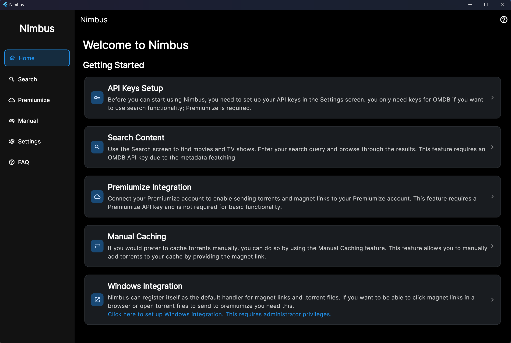
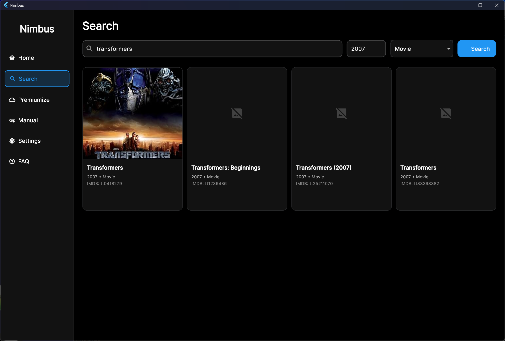
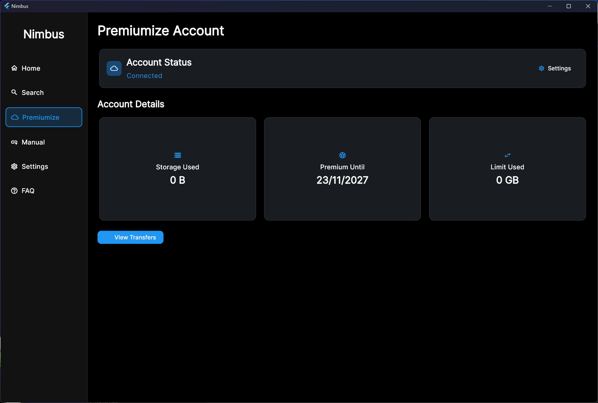
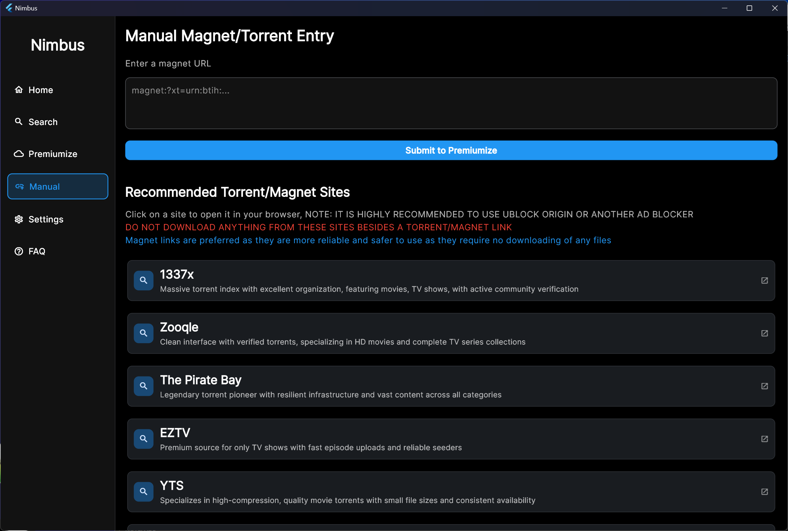
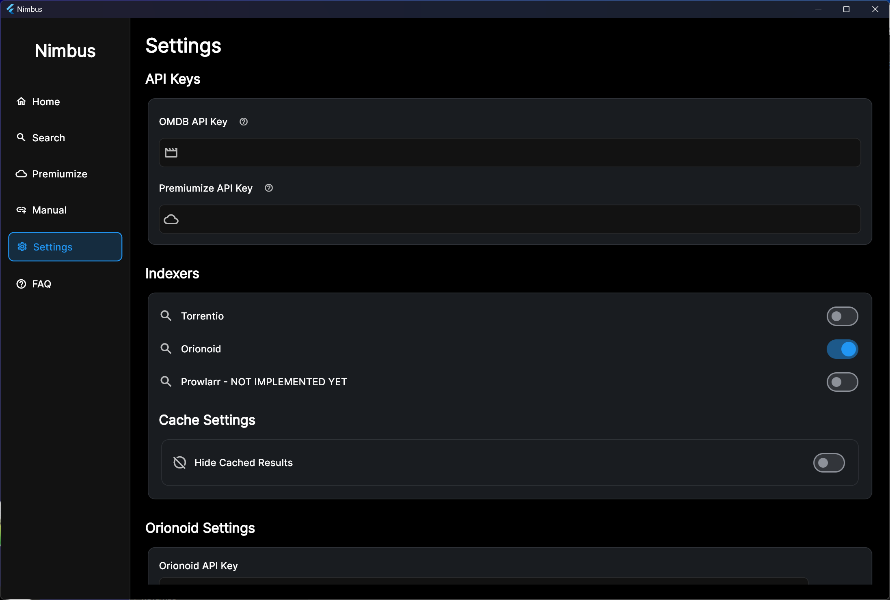
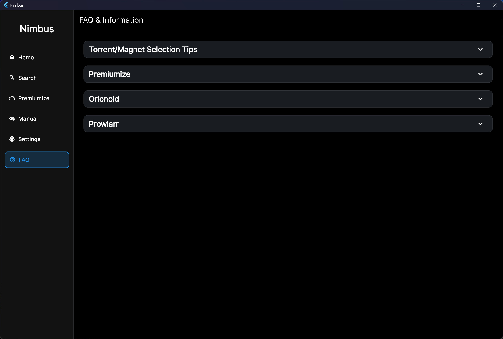
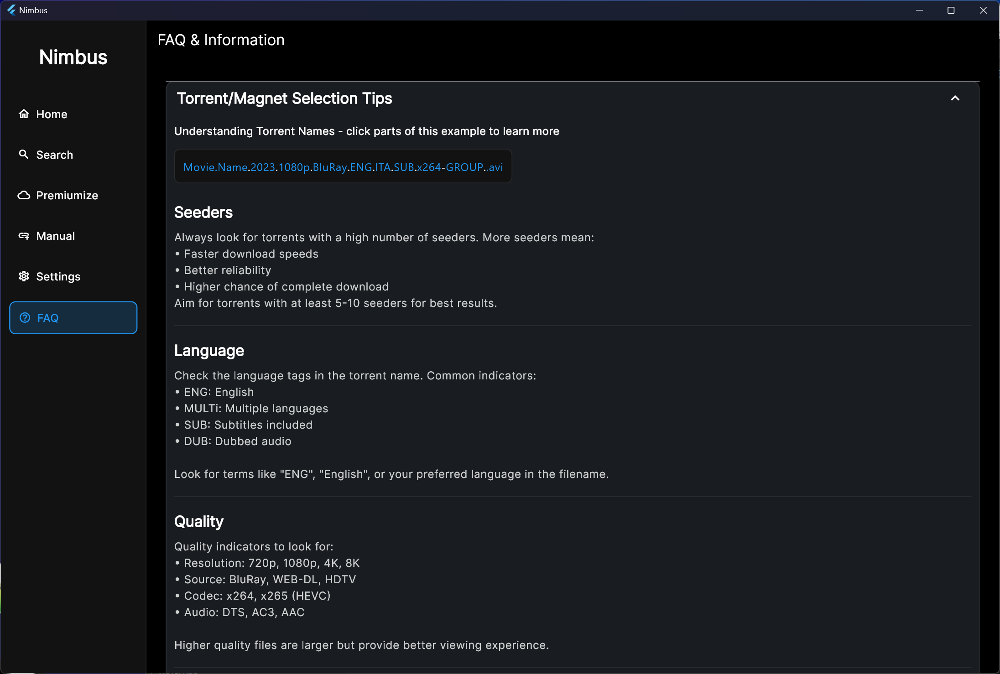

# Nimbus - Premiumize Media Caching Tool 🚀🚀🚀

[](https://flutter.dev)
[](https://opensource.org/licenses/MIT)
[-brightgreen.svg)](https://flutter.dev/multi-platform/)

Nimbus is a desktop application built with Flutter, designed for Windows (MacOS planned). It helps users easily cache movies and TV shows to your Premiumize cloud storage that aren't already cached. The app provides a streamlined interface for searching, selecting, and caching media content.

## 🌟 Features

- **🎬 Media Search & Caching**
  - OMDB integration for movie and TV show information
  - Torrentio and Orionoid integration for finding content
  - Direct caching to Premiumize cloud storage

- **☁️ Premiumize Integration**
  - Account information display
  - Transfer management and monitoring
  - Detailed instructions for setup
  - Cache status checking

- **🔍 Indexer Support**
  - Orionoid
  - Torrentio 
  - Prawlarr * Note Prowlarr is not yet implemented but it planned

- **🎨 User Interface**
  - Dark mode theming
  - Responsive design for desktop platforms
  - Dynamic sizing
  - Easy sidebar navigation

## 📸 Screenshots

### 🏠 Main / Home Screen

### 🔎 Search Screen

### ☁️ Premiumize Screen

### ⚙️ Manual Cache Screen

### ⚙️ Settings Screen

### ❓ FAQ Screen

### ❓ FAQ Screen 2


## 🛠️ Technical Stack

- **State Management**: Riverpod
- **Navigation**: Go Router
- **Storage**: Shared Preferences
- **HTTP Client**: Dio
- **UI**: ScreenUtil, Google Fonts, Flutter Animate
- **Platform Specific**: Windows Notifications, Windows Registry

## 📋 Compile Instructions

1. **Prerequisites**
   - Flutter SDK (^3.6.0)
   - Dart SDK
   - Windows development environment

2. **Installation**
   ```bash
   git clone [repository-url]
   cd nimbus
   flutter pub run build_runner build --delete-conflicting-outputs
   flutter build windows
   ```

3. **API Keys**
   - OMDB API key required if you want to search movies/shows
   - Premiumize API key required
   - Orionoid API key required if you plan to use it

4. **testing before compilation**
   ```bash
   flutter clean
   flutter pub run build_runner build --delete-conflicting-outputs
   flutter run -d windows
   ```

## 📝 Development Guidelines

- Use Riverpod for state management
- Go Router for navigation
- Ensure resizxable UI with ScreenUtil
- Adhere to dark mode theming

## 🤝 Contributing

1. Fork the repository
2. Create your feature branch
3. Commit your changes
4. Push to the branch
5. Create a Pull Request

## 🙏 Acknowledgments

- **Flutter Team** for the amazing framework
- **Orionoid** for their comprehensive media API
- **Torrentio** for their comprehensive media API
- **Premiumize.me** for their cloud service integration
- **Riverpod maintainers** for state management solutions
- **Material Design team** for UI components

---

### 📌 Suggestions for improvement are welcome

## 📄 License

MIT License

Copyright (c) 2024 Nimbus

Permission is hereby granted, free of charge, to any person obtaining a copy
of this software and associated documentation files (the "Software"), to deal
in the Software without restriction, including without limitation the rights
to use, copy, modify, merge, publish, distribute, sublicense, and/or sell
copies of the Software, and to permit persons to whom the Software is
furnished to do so, subject to the following conditions:

The above copyright notice and this permission notice shall be included in all
copies or substantial portions of the Software.

THE SOFTWARE IS PROVIDED "AS IS", WITHOUT WARRANTY OF ANY KIND, EXPRESS OR
IMPLIED, INCLUDING BUT NOT LIMITED TO THE WARRANTIES OF MERCHANTABILITY,
FITNESS FOR A PARTICULAR PURPOSE AND NONINFRINGEMENT. IN NO EVENT SHALL THE
AUTHORS OR COPYRIGHT HOLDERS BE LIABLE FOR ANY CLAIM, DAMAGES OR OTHER
LIABILITY, WHETHER IN AN ACTION OF CONTRACT, TORT OR OTHERWISE, ARISING FROM,
OUT OF OR IN CONNECTION WITH THE SOFTWARE OR THE USE OR OTHER DEALINGS IN THE
SOFTWARE.

